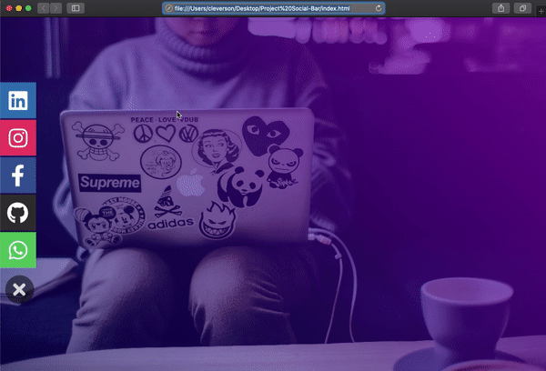

<div align="center">
  <p align="center">
    </img>
  </p>
  <h1>Projeto com HTML5 e CSS3</h1>
  <p>
    Desenvolvimento criativo de Barra lateral <strong>Social Media Icons</strong>
    <br/>
    apenas com o uso de HTML e CSS
    <br/>
      sem o uso de <i>JavaScript</i>.
    <br/>
  </p>
</div>
<br/>
<br/>
<br/>

# **Social Media Icons**
  Previewer do projeto.
  
  

  Um projeto relativamente simples, porém com uso de recursos bem legais de **CSS** e alguns recursos de **HTML** como (checkbox) para o funcionamento da manipulação da **_div_** dos ícones.

---

## Uso no HTML do seu projeto.
  Para usar basta simplesmente inserir o conteúdo HTML da _**div**_  _"social-container"_ dentro do _**body**_ do seu projeto e o CSS dentro do arquivo de _**stylesheet**_.
  ```HTML
  <body>
    <div class="social-container">
      <!-- conteúdo -->
    </div>
  </body>
  ```
  Por fim, substitua o _**href="#"**_ pelos links que convém para o projeto.
  
  ```HTML
  <a href="http://www.facebook.com/fulano-de-tal">
  ```
  ---
